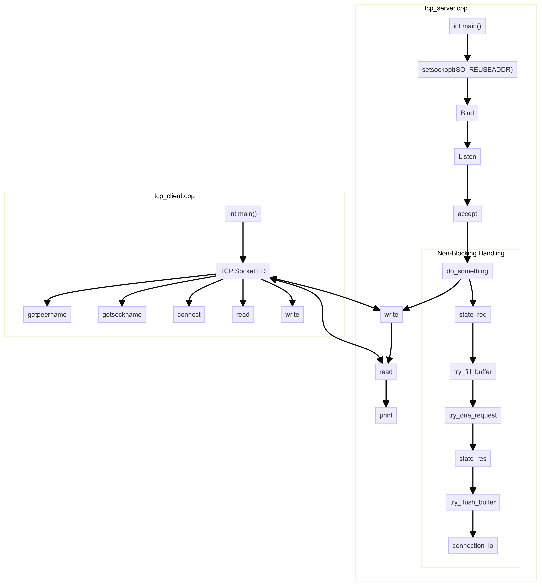

# Simple Non-blocking TCP Server

This project implements a simple non-blocking TCP server using C++. The server can handle multiple client connections simultaneously without blocking, using the `poll` system call.

## Features

- Non-blocking I/O for handling multiple connections.
- Supports basic request and response communication.
- Manages connections using a state machine.

## Requirements

- C++ compiler (supporting C++11 or later)
- POSIX-compliant operating system (Linux, macOS)

## Building the Project

To build the project, compile the source file with a C++ compiler. For example:

```sh
g++ -o server server.cpp
```

## Running the Server

Run the compiled server executable. The server listens on port 1234.

```sh
./server
```
