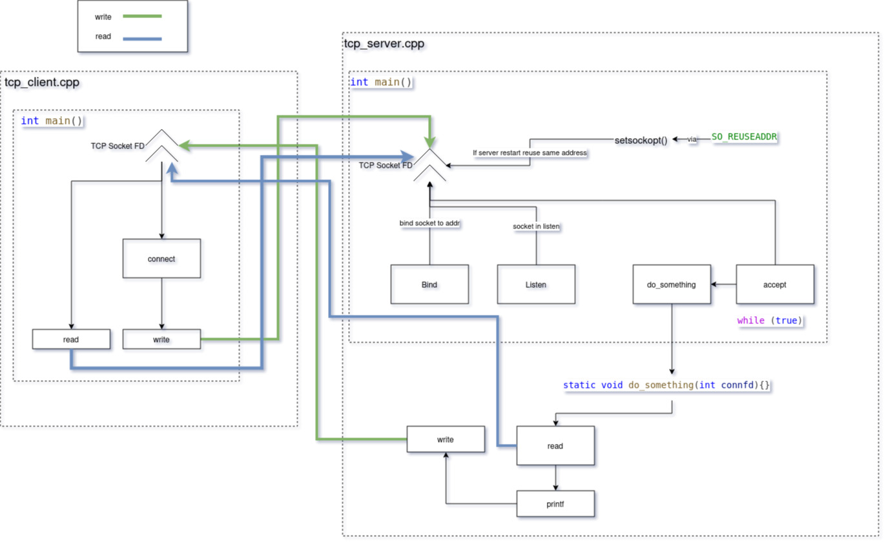

## Schema del funzionamento Client-Server TCP
Lato Server:

    Creazione del socket TCP:
        Il server crea un socket TCP usando socket(AF_INET, SOCK_STREAM, 0);.

    Configurazione del socket:
        Il server imposta l'opzione SO_REUSEADDR per consentire il riutilizzo dell'indirizzo e della porta subito dopo la chiusura del socket usando setsockopt().

    Binding dell'indirizzo:
        Il server associa l'indirizzo e la porta al socket usando bind().

    Ascolto delle connessioni in ingresso:
        Il server entra in modalità di ascolto usando listen() per accettare le connessioni in ingresso.

    Accettazione delle connessioni:
        Il server accetta le connessioni in entrata usando accept(), creando un nuovo socket per gestire la comunicazione con il client.

    Comunicazione con il client:
        Il server legge i dati inviati dal client usando read() e invia la risposta usando write().

    Chiusura della connessione:
        Il server chiude il socket di connessione con il client usando close() quando la comunicazione è completa.

    Funzione one_request:

        La funzione one_request gestisce un ciclo completo di richiesta e risposta con un client. Legge un messaggio dalla connessione, verifica eventuali errori, e se tutto è corretto, invia una risposta. La funzione assicura che il messaggio ricevuto non superi una dimensione massima predefinita e gestisce correttamente i casi di errore.    
    
## Lato Client:

    Creazione del socket TCP:
        Il client crea un socket TCP usando socket(AF_INET, SOCK_STREAM, 0);.

    Configurazione dell'indirizzo del server:
        Il client configura l'indirizzo del server a cui connettersi:
            Famiglia di indirizzi (AF_INET).
            Porta del server in network byte order usando htons().
            Indirizzo IP del server usando htonl() per convertire l'indirizzo in formato network byte order.

    Connessione al server:
        Il client si connette al server usando connect() specificando l'indirizzo del server.

    Invio dei dati al server:
        Il client invia i dati al server usando write().

    Lettura della risposta dal server:
        Il client legge la risposta dal server usando read().

    Chiusura della connessione:
        Il client chiude il socket usando close() dopo aver completato la comunicazione con il server.
    
    Funzione quey:
        La funzione query effettua le seguenti operazioni:

        Calcola la lunghezza del messaggio da inviare e verifica che non superi la dimensione massima.
        Prepara un buffer che include la lunghezza del messaggio e il messaggio stesso.
        Invia il buffer al server.
        Riceve l'header della risposta dal server.
        Verifica che la lunghezza della risposta non superi la dimensione massima.
        Riceve il corpo della risposta dal server.
        Termina la stringa di risposta e la stampa.
   