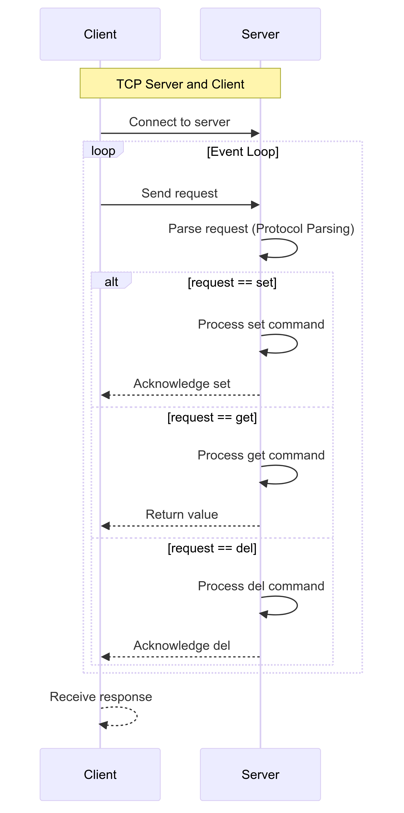

# Simple Non-blocking TCP Server

This project implements a simple non-blocking TCP server using C++. The server can handle multiple client connections simultaneously without blocking, using the `poll` system call.

## Features

- Non-blocking I/O for handling multiple connections.
- Supports basic request and response communication.
- Manages connections using a state machine.

## Requirements

- C++ compiler (supporting C++11 or later)
- POSIX-compliant operating system (Linux, macOS)

## Building the Project

To build the project, compile the source file with a C++ compiler. For example:

```sh
g++ -o server server.cpp
```

## Running the Server

Run the compiled server executable. The server listens on port 1234.

```sh
./server
```

## Code Overview

### Includes and Constants

```cpp
#include <assert.h>
#include <stdint.h>
#include <stdlib.h>
#include <string.h>
#include <stdio.h>
#include <errno.h>
#include <fcntl.h>
#include <poll.h>
#include <unistd.h>
#include <arpa/inet.h>
#include <sys/socket.h>
#include <netinet/ip.h>
#include <vector>

const size_t k_max_msg = 4096;
```

### Connection Structure and States

```cpp
enum {
    STATE_REQ = 0,
    STATE_RES = 1,
    STATE_END = 2,
};

struct Conn {
    int fd = -1;
    uint32_t state = 0;
    size_t rbuf_size = 0;
    uint8_t rbuf[4 + k_max_msg];
    size_t wbuf_size = 0;
    size_t wbuf_sent = 0;
    uint8_t wbuf[4 + k_max_msg];
};
```

### Utility Functions

```cpp
static void msg(const char *msg);
static void die(const char *msg);
static void fd_set_nb(int fd);
```

### Connection Handling Functions

```cpp
static void conn_put(std::vector<Conn *> &fd2conn, struct Conn *conn);
static int32_t accept_new_conn(std::vector<Conn *> &fd2conn, int fd);
static void state_req(Conn *conn);
static void state_res(Conn *conn);
static bool try_one_request(Conn *conn);
static bool try_fill_buffer(Conn *conn);
static bool try_flush_buffer(Conn *conn);
static void connection_io(Conn *conn);
```

### Main Function

```cpp
int main();
```

## Detailed Explanation

1. **Initialization**: The server socket is created, configured to be non-blocking, and bound to a port.
2. **Event Loop**: Uses `poll` to wait for events on the server socket and client connections.
3. **Connection Handling**: Accepts new connections and processes incoming requests and outgoing responses.
4. **State Management**: Manages connection states (request, response, end) using a state machine.